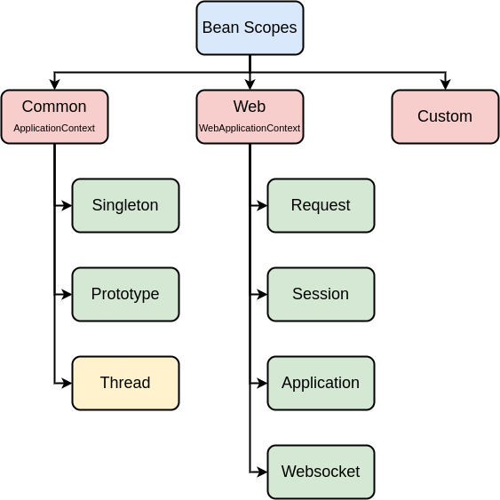
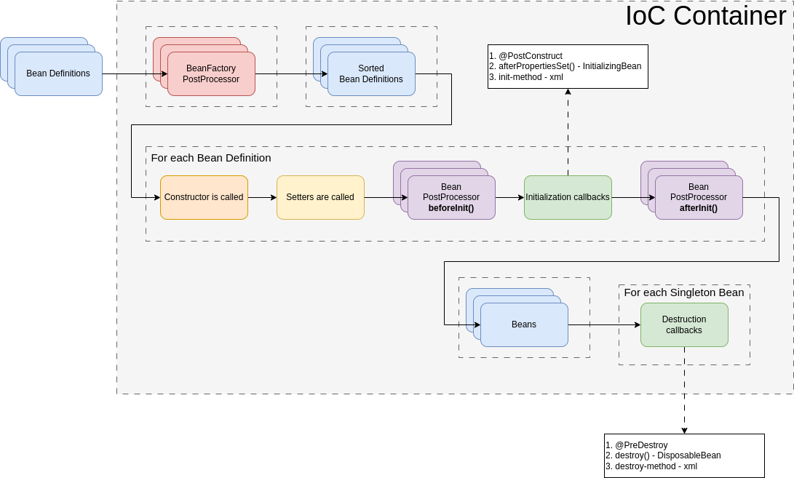

# Spring

## 1. Введение


## 2. Установка ПО


## 3. IoC & DI
**Object Dependencies** (зависимости объекта) - это другие объекты (чаще всего других классов), с которыми работает текущий объект и использует их функциональность.

**Inversion of Control** (IoC - инверсия управления) - это принцип программирования, при котором управление выполнением программы передается фреймворку, а не программисту

Происходит потеря контроля над выполнением кода: фреймворк управляет кодом программиста, а не программист управляет фреймворком.

**Dependency Injection** (DI - внедрение зависимостей) - это одна из реализаций инверсии управления (IoC), посредством которой созданием объекта и компоновкой его зависимостей занимается другой объект (фреймворк).

Фреймворк определяет и внедряет зависимости через:
- параметры конструктора;
- параметры статического метода инициализации (фабричный метод);
- свойства объекта (сеттеры).

## 4. IoC Container
**IoC Container** - объект,который занимается созданием других объектов и внедрением в них зависимостей (**DI**).

Является ассоциативным массивом:
- ключ - идентификатор (строка);
- значение - сам объект.

Такой внедряемый объект называется **Bean**'ом.

**Bean** - объект со всеми необходимыми зависимостями, который был создан с помощью **IoC Container**.

**Metadata** - совокупность объектов (**Bean Definition**), которые говорят IoC Container'у как создавать Bean, конфигурировать и внедрять их зависимости.

Типы Bean Definition:
- XML-based;
- Annotation-based;
- Java-based.

## 5. XML-based Configuration
Для подключения Spring необходимы spring-core и spring-context.

Корневой интерфейс - **BeanFactory**.

Больший функционал предоставляет **ApplicationContext**. Его и подразумевают под IoC Container'ом.

**ClassPathXmlApplicationContext** работает с XML-конфигурацией. В него передается путь к **application.xml**.

Пример **application.xml**:
```xml
<?xml version="1.0" encoding="UTF-8"?>
<beans xmlns="http://www.springframework.org/schema/beans"
       xmlns:xsi="http://www.w3.org/2001/XMLSchema-instance"
       xsi:schemaLocation="http://www.springframework.org/schema/beans http://www.springframework.org/schema/beans/spring-beans.xsd">

    <bean id="pool1" name="p1,p2,p3" class="com.dmdev.spring.database.pool.ConnectionPool"/>
    <bean id="pool2" name="p4" class="com.dmdev.spring.database.pool.ConnectionPool"/>

</beans>
```

class является обязательным атрибутом. Без предоставления id он будет выступать за него: com.dmdev.spring.database.pool.ConnectionPool#0.

По умолчанию вызывается конструктор без параметров.

В **applicationContext.beanFactory.beanDefinitionMap** можно увидеть все Bean'ы.

В приведенном примере xml будут созданы два синглтона: если получить Bean по классу, будет ошибка.

## 6. Constructor Injection
Пример:
```java
public class ConnectionPool {

    private final String username;
    private final Integer poolSize;
    private final List<Object> args;
    private final Map<String, Object> properties;

    public ConnectionPool(String username,
                          Integer poolSize,
                          List<Object> args,
                          Map<String, Object> properties) {
        this.username = username;
        this.poolSize = poolSize;
        this.args = args;
        this.properties = properties;
    }
}
```

```xml
<?xml version="1.0" encoding="UTF-8"?>
<beans xmlns="http://www.springframework.org/schema/beans"
       xmlns:xsi="http://www.w3.org/2001/XMLSchema-instance"
       xsi:schemaLocation="http://www.springframework.org/schema/beans http://www.springframework.org/schema/beans/spring-beans.xsd">

    <bean id="driver" class="java.lang.String">
        <constructor-arg type="java.lang.String" value="PostgresDriver"/>
    </bean>

    <bean id="pool1" name="p1,p2,p3" class="com.dmdev.spring.database.pool.ConnectionPool">
        <constructor-arg name="username" type="java.lang.String" value="postgres"/>
        <constructor-arg name="properties" type="java.util.Map">
            <map>
                <entry key="url" value="postgresurl"/>
                <entry key="password" value="123"/>
            </map>
        </constructor-arg>
        <constructor-arg name="poolSize" type="java.lang.Integer" value="10"/>
        <constructor-arg name="args" type="java.util.List">
            <list>
                <value>--arg1=value1</value>
                <value>--arg2=value2</value>
            </list>
        </constructor-arg>
    </bean>
<!--    <bean id="pool2" name="p4" class="com.dmdev.spring.database.pool.ConnectionPool"/>-->

</beans>
```

Можно использовать тэг **index** (в принципе, не надо).

Типы указываются для уточнения нужного конструктора (пример с **driver**).

## 7. Factory Method Injection
Чтобы использовать другие бины, следует использовать **ref**. В мапах - **value-ref**, в списках  - **\<ref/>**.

Для использования фабричного метода используется **factory-method="название"**.

Есть еще **factory-bean** - что-то типа фабрики.

## 8. Property Injection
Setter'ы убивают иммутабельность 💀.

Для Property Injection следует использовать **\<property/>**.

Пример:
```xml
<property name="properties">
    <map>
        <entry key="url" value="postgresurl"/>
        <entry key="password" value="123"/>
        <entry key="driver" value-ref="driver"/>
    </map>
</property>
```

Сначала вызываются конструкторы, потом сеттеры. Это намекает на наличие жизненного цикла Bean'ов. Самый простой вариант:

Bean definitions -> IoC Container [Sorted Bean Definitions -> For each Bean Definition [Bean constructor called -> Setters called] -> Beans]

Sorted - одни бины могут зависеть от других -> нужен порядок их создания. 

Циклические зависимости можно установить через сеттеры, но это bad practice (?).

## 9. Bean Scopes


Bean Scopes
  - Common (ApplicationContext)
    - singleton
    - prototype
    - thread (используют ThreadLocal)
  - Web (WebApplicationContext)
    - request
    - session
    - application
    - websocket
  - Custom

По умолчанию - singleton (один экземпляр).

prototype - создаются каждый раз. В ApplicationContext не хранятся.

## 10. Lifecycle Callbacks
Улучшаем Beans Lifecycle:

Bean definitions -> IoC Container [Sorted Bean Definitions -> For each Bean Definition [Bean constructor called -> Setters called -> **Initialization callbacks**] -> Beans -> For each Singleton Bean [**Destruction callbacks**]]

Initialization callbacks:
1. @PostConstruct
2. afterPropertiesSet() - InitializingBean
3. init-method - xml

Destruction callbacks
1. @PreDestroy
2. destroy() - DisposableBean
3. destroy-method - xml

## 11. Injecction from properties
Создаем application.properties. Каждое слова через точку, к-з через равно.

Пример application.properties:
```properties
db.username=postgres
db.password=pass
db.pool.size=12
db.driver=PostgresDriver
db.url=postgres:5432
db.hosts=localhost
#db.hosts=localhost,127.0.0.1
```

В application.xml:
```xml
<bean class="org.springframework.context.support.PropertySourcesPlaceholderConfigurer">
    <property name="locations" value="classpath:application.properties"/>
</bean>
```

Либо через namespace:
```xml
<context:property-placeholder location="classpath:application.properties"/>
```

Можно использовать expression-language с помощью ${...}:
```xml
<bean id="driver" class="java.lang.String">
    <constructor-arg type="java.lang.String" value="${db.driver}"/>
</bean>
```

А еще есть SpEL (**Sp**ring **E**xpression **L**anguage)!
Пример:
```xml
<property name="properties">
        <map>
            <entry key="url" value="postgresurl"/>
            <entry key="password" value="123"/>
            <entry key="driver" value="#{driver.substring(3)}"/>
            <entry key="test" value="#{driver.length() > 10}"/>
            <entry key="test1" value="#{driver.length() > T(Math).random() * 10}"/>
            <entry key="hosts" value="#{'${db.hosts}'.split(',')}"/>
            <entry key="currentUser" value="#{systemProperties['user.name']}"/>
            <entry key="currentUser" value="${user.name}"/>
        </map>
</property>
```

## 12. BeanFactoryPostProcessor
В жизненном цикле бинов находится до **Sorted Bean Definitions**.

- Устанавливает переменные окружения;
- Подставляет значения expression language.

Реализован на паттерне **Visitor**.

Бины можно получать по реализованным интерфейсам и родительскому классу. Spring узнает, является ли **attributeClass** **BeanDefinition**'а объектом типа **BeanFactoryPostProcessor**.

## 13. Custom BeanFactoryPostProcessor
Интерфейс Ordered позволяет выставлять приоритет BFPP.

## 14. Annotation-based Configuration
Аннотации **@PostConstruct** и **@PreDestroy** находятся в **jakarta.annotation-api**.

В application.xml добавляется:
```xml
 <bean class="org.springframework.context.annotation.CommonAnnotationBeanPostProcessor"/>
```

 или:

```xml
 <context:annotation-config/>
```

**annotation-config** помимо **CommonAnnotationBeanPostProcessor** добавит еще 4 бина:

1. CommonAnnotationBeanPostProcessor (BeanPostProcessor)
  - @PreDestroy
  - @PostConstruct
  - @Resource
2. AutowiredAnnotationBeanPostProcessor (BeanPostProcessor)
  - @Autowired
  - @Value
3. EventListenerMethodProcessor (BeanFactoryPostProcessor)
  - @EventListener
4. ConfigurationClassPostProcessor (BeanFactoryPostProcessor)
  - @Configuration
5. PresistenceAnnotationBeanPostProcessor (BeanPostProcessor)
  - @PersistenceContext
  - @PersistenceUnit

## 15. BeanPostProcessor
У интерфейса **BeanPostProcessor** два метода:
```java
default Object postProcessBeforeInitialization(Object bean, String beanName) {
    return bean;
}

default Object postProcessAfterInitialization(Object bean, String beanName) {
    return bean;
}
```

**Финальный вид Beans Lifecycle**:


**@PostConstruct** - это тоже BPP (?).

Интерфейсы-осведомители **Aware** позволяют inject'ать специфичные бины. Пример - **ApplicationContextAware**:
```java
public interface ApplicationContextAware extends Aware {
    void setApplicationContext(ApplicationContext applicationContext) throws BeansException;
}
```

Aware-классами занимается **ApplicationContextAwareProcessor** BPP.

## 16. Custom BeanPostProcessor I
В Spring есть **ReflectionUtils** 😏.

## 17. Custom BeanPostProcessor II
Не стоит возвращать в **beforeInit()** прокси! Тогда init-коллбэки потеряют нужный класс! Поэтому следует создавать прокси в **afterInit()**.  А в beforeInit() сохранят к-з идентификатора бина и его имени. Пример:
```java
public class TransactionBeanPostProcessor implements BeanPostProcessor {

    private final Map<String, Class<?>> transactionBeans = new HashMap<>();

    @Override
    public Object postProcessBeforeInitialization(Object bean, String beanName) throws BeansException {
        if (bean.getClass().isAnnotationPresent(Transaction.class)) {
            transactionBeans.put(beanName, bean.getClass());
        }
        return bean;
    }

    @Override
    public Object postProcessAfterInitialization(Object bean, String beanName) throws BeansException {
        Class<?> beanClass = transactionBeans.get(beanName);
        if (beanClass != null) {
            return Proxy.newProxyInstance(beanClass.getClassLoader(), beanClass.getInterfaces(),
                    (proxy, method, args) -> {
                        System.out.println("Open transaction");
                        try {
                            return method.invoke(bean, args);
                        } finally {
                            System.out.println("Close transaction");
                        }
                    });
        }
        return bean;
    }
}
```

Родной DynamicProxy из java.lang.reflect работает через интерфейсы (не через наследование). 

## 18. Autowired & Value
**@Autowired** - инжектает бины. **@Resource** - удовлетворяет Java EE JSR-250. Следует использовать **@Autowired**.

Если бинов-кандидатов несколько, можно использовать **@Resource(name = "")** или комбинацию **@Autowired** и **@Qualifier("")**. **@Autowired** полагается на тип бина.
Также вместо **@Qualifier** достаточно назвать поле так же, как айди бина.

**@Autowired** можно ставить над сеттерами.

Также сильная сторона **@Autowired** - можно инжектать зависимости в коллекции.

**@Value** - позволяет инжектать через **expression language**.

## 19. Classpath Scanning
Принято использовать аннотации в конструкторе.

```xml
<context:component-scan base-package="packacge"/>
```

ComponentScanBeanDefinitionParser позволяет автоматически искать классы, на основании которых нужно создать bean'ы (bean definition'ы, на самом деле). Фильтр поиска - аннотация **@Component** (**@Controller**, **@Repository**, **@Service**).

**@Component("")** - даёт id. по умолчанию - название классов с маленькой буквы.

Если несколь конструкторв, то автоматический скан вызывает конструктор с **@Autowired**. Если конструктор один - вызывает его.

## 20. Bean Definition Readers
- Bean Definition Readers
  - BeanDefinitionReader == XML-based configuration
    - XmlBeanDefinitionReader
    - GroovyBeanDefinitionReader
    - PropertiesBeanDefinitionReader
  - ClassPathBeanDefinitionReader & AnnotatedBeanDefinitionReader == Annotation-based configuration
    - TypeFilter
  - ConfigurationClassBeanDefinitionReader == Java-based configuration
    - @Configuration
      - @Bean

BeanDefinitionParser - интерфейс для сканирования. Реализуется через I/O.

## 21. Type Filters
```xml
<!--    <context:annotation-config></context:annotation-config>-->
<context:component-scan base-package="com.dmdev.spring"
                        annotation-config="true"
                        resource-pattern="**/*.class"
                        scoped-proxy="no"
                        use-default-filters="false">
```

**annotation-config="true"** вместо \<context:annotation-config></context:annotation-config>.

**name-generator** - свой генератор имен.

**resource-pattern="**/*.class"** - паттерн для поиска.

**scoped-proxy="no"** - тип прокси:
- no
- interfaces
- targetClass - на основании наследования (в Spring исползуется CGLIB)

**scoped-proxy="no"**

**use-default-filters="true"** - фильтры для поиска бинов в пакете.
- annotation
- assignable
- regex
- aspectj
- custom

## 22. Scope
**AnnotationScopeMetaDataResolver** ищет аннотацию **@Scope**.

Есть константы для соотв. скоупов.

## 23. JSR-250 & JSR-330
JSR-250:
Managed Bean == Value

JSR-330:
DI-спецификация.
Inject == Autowired
Named == Component, Qualifier
Qualifer == Qualifier
Singleton == Scope
Scope

## 24. Java-based configuration
Создаются классы для конфигураций. Класс помечается **@Configuration**.

**@PropertySource("classpath:application.properties")**.

**@ComponentScan()** - те же настройки, что и в XML.

## 25. Import & ImportResource
**@ImportResource** - можно добавить XML.
**@Import** - добавляем доп. конфигурационные классы.

## 26. Bean I
В **@Configuration** классах возможно создавать бины следующим образом:
```java
@Bean("pool2")
@Scope(BeanDefinition.SCOPE_SINGLETON)
public ConnectionPool pool2(@Value("${db.username}") String username) {
    return new ConnectionPool(username, 20);
}

@Bean
public UserRepository userRepository2(ConnectionPool pool2) {
    return new UserRepository(pool2);
}
```

**Название метода == id бина!**
**Название параметра == id бина!**

## 27. Bean II
```java
@Bean
public UserRepository userRepository3() {
    var connectionPool1 = pool3();
    var connectionPool2 = pool3();
    var connectionPool3 = pool3();
    return new UserRepository(pool3());
}
```

Создастся 1 пул (т. к. синглтон). **ApplicationConfiguration** обёрнут в прокси (настраивается аннотацией). В нём вызывается метод **intercept()**.

## 28. Profiles
Находятся в Environment. Позволяют активироват\деактивировать конфигурации и бины на основании подключенного профайла.

Аннотация @Profile ставится над классами-конфигурациями и методами. Можно использовать булевы операторы И\ИЛИ.

Пример активации в application.properties:
```properties
spring.profiles.active=web
```

~~Профили можно активировать через контекст. После установки надо вызвать refresh() (Там че-то сложно, правда).~~

## 29. Event Listeners I
Listener - subscribe/unsubscribe (добавления лисенера в список).

Event - набор полей.

Пример:
```java
public enum AccessType {
    CREATE, UPDATE, READ, DELETE
}

public class EntityEvent extends EventObject /*extends ApplicationEvent - лучше*/ {

    private final AccessType accessType;

    public EntityEvent(Object entity, AccessType accessType) {
        super(entity);
        this.accessType = accessType;
    }

    public AccessType getAccessType() {
        return accessType;
    }
}

@Component
public class EntityListener {

    @EventListener
    @Order(10)
    public void acceptEntity(EntityEvent entityEvent) {
        System.out.println("Entity: " + entityEvent);
    }
}

/* class CompanyService: */
private final ApplicationEventPublisher eventPublisher;

public Optional<CompanyReadDto> findById(Integer id) {
    return companyRepository.findById(id)
        .map(entity -> {
            eventPublisher.publishEvent(new EntityEvent(entity, AccessType.READ));
            return new CompanyReadDto(entity.id());
        });
}
```

## 30. Event Listeners II
Коллекцию листенеров можно управлять с помощью **@Order**.

**@EventListener** может использовать condition вместе с SpEL: например, использовать args листенера.

Пример:
```java
@Component
public class EntityListener {

    @EventListener(condition="#root.args[0].accessType.name() == 'READ'")
    @Order(10)
    public void acceptEntity(EntityEvent entityEvent) {
        System.out.println("Entity: " + entityEvent);
    }
}
```

## 31. Spring Boot Введение
SpringBoot предоставляет AutoConfiguration.

С помощью Conditions имеется возможность включать\выключать модули динамически. Они работают исходя из classpath/properties/bean.

Starters добавляют нужный функционал.

## 32. Conditional
**@Conditional**
Таргет - тип и метод (метод, помеченный **@Bean**!).

Пример:
```java
@Conditional(JpaCondition.class)
@Configuration
public class JpaConfiguration {

    @PostConstruct
    void init() {
        System.out.println("Jpa configuration is enabled");
    }
}

public class JpaCondition implements Condition {

    @Override
    public boolean matches(ConditionContext context, AnnotatedTypeMetadata metadata) {
        try {
            context.getClassLoader().loadClass("org.postgresql.Driver");
            return true;
        } catch (ClassNotFoundException e) {
            return false;
        }
    }
```

**@Profile** помечен **@Conditional**!

## 33. Spring Boot Настройка проекта
Используется spring-boot-starter.

Вот так выглядит приложение со Spring Boot:
```java
@SpringBootApplication
public class ApplicationRunner {

    public static void main(String[] args) {
        SpringApplication.run(ApplicationRunner.class, args);
    }
}
```

Также можно использовать [Spring Initializr](https://start.spring.io/).

В Maven используется spring-boot-starter-parent.

## 34. SpringBootApplication
Должен лежать в рутовом проекте.

**run()** - создаёт контекст.

Аннотация **@SpringBootApplication** должна быть одна. **@SpringBootApplication** помечен **@SprinBootConfiguration** и **@ComponentScan**.

## 35 Lombok
**@RequiredArgsConstructor - для полей final.**
**@AllArgsConstuctor** - для всех.

**@Value** (Spring) переносится из параметра конструктора на поле, и в lombok.config добавить нужные аннотации:
```
config.stopBubbling = true

lombok.copyableannotations += org.springframework.beans.factory.annotation.Value
lombok.copyableannotations += org.springframework.beans.factory.annotation.Qualifier
```

stopBubbling - рутовый конфиг.

## 36. Properties
**spring.properties** - low-level конфигурация Spring.

Проперти иерархичны, одни перекрывают другие по приоритету.

Профили перекрывают значения из **application.properties**. Профили помечаются **application-{profile}.properties**. В **application.properties** добавляется:
```properties
spring.profiles.active={profile}
```

В программных аргументах используются два дефиса (*TODO: проверить, обязательно ли*).

VM options начинаются с -D.

Property Placeholders - подставляются, если не передали значения. Дефолтное значение ставится после двоеточия. Пример:
```properties
db.username=${username.value:postgres}
```

В программных аргументах можно указать
```
--spring.config.location={location}
```

Можно добавить перед этим "optional:".

## 37. yaml
Пример application.yaml:
```yaml
db:
  username: ${username.value:postgres}
  password: pass
  driver: PostgresDriver
  url: postgres:5432
  hosts: localhost,127.0.0.1
  pool:
    size: 12
    timeout: 10
  pools:
    - size: 1
      timeout: 1
    - size: 2
      timeout: 2
    - size: 3
      timeout: 3
spring.profiles.active: qa
```

## 38. ConfigurationProperties
Можно преобразовать yaml в Bean! Для этого требуется создать класс и добавить в него все поля.

Пример:
```java
@ConfigurationProperties(prefix = "db")
public record DatabaseProperties(String username,
                                 String password,
                                 String driver,
                                 String url,
                                 String hosts,
                                 PoolProperties pool,
                                 List<PoolProperties> pools,
                                 Map<String, Object> properties) {

    public static record PoolProperties(Integer size,
                                        Integer timeout) {
    }
}
```
Должен быть POJO: геттеры, сеттеры и конструктор без параметров.

Теперь можно создать Bean:
```java
@Bean
@ConfigurationProperties(prefix = "db")
public DatabaseProperties databaseProperties() {
    return new DatabaseProperties();
}
```
А можно поставить **@ConfigurationProperties(prefix = "db")** у класса, добавить **@Component**, у **ApplicationRunner** добавить **@ConfigurationPropertiesScan**.

## 39. logging-starter
**@Slf4j** из Lombok генерирует логгер.

В yaml можно добавить:
```yaml
logging:
  level:
    root: WARN
    com.dmdev.spring.database.pool: INFO
```

## 40. Logback Configuration
Можно добавить файловый логгер:
```yaml
logging:
  level:
    root: WARN
    com.dmdev.spring.database.pool: INFO
  file:
    name: dmdev.log
    path: /
```

Остальная настройка логгера происходит через **logback-spring.xml**:
```xml
<configuration>

    <appender name="STDOUT" class="ch.qos.logback.core.ConsoleAppender">
        <!-- encoders are assigned the type
             ch.qos.logback.classic.encoder.PatternLayoutEncoder by default -->
        <encoder>
            <pattern>%d{HH:mm:ss.SSS} [%thread] %-5level %logger{36} - %msg%n</pattern>
        </encoder>
    </appender>

    <root level="INFO">
        <appender-ref ref="STDOUT" />
    </root>
</configuration>
```

## 41. test-starter
junit, mockito есть транзитивно в test-starter.

**@ExtendWith(MockitoExtension.class)**

## 42. Integration Testing I
Цели интеграционных тестов в Spring:
- DI (Spring Context Beans)
- Context Caching
- Transaction Management

Используем SpringExtension: для каждого тест-класса будет создан **TestContextManager**: в нём есть **TestContext** и **TextExecutionListener**.

## 43. Integration Testing II
Постфикс **IT** для классов зарезрвирован для интеграционных тестов.

**@ExtendWith(SpringExtension.class)**
**@ContextConfiguration(classes = ApplicationRunner.class)** - для указания контекста.

**@TestPropertySource** - для **application.properties**. Для YAML не работает. Решение: в **@ContextConfiguration** есть **initializers = ConfigApplicationContextInitializer**.

Вместо
```java
@ExtendWith(SpringExtension.class)
@ContextConfiguration(classes = ApplicationRunner.class, initializers = ConfigDataApplicationContextInitializer.class)
```

можно использовать:
```java
@SpringBootTest
```

**@SpringBootTest** найдет spring Boot конфигурации.

Пример **юнит-теста**:
```java
@ExtendWith(MockitoExtension.class)
class CompanyServiceTest {

    private static final Integer COMPANY_ID = 1;

    @Mock
    private CrudRepository<Integer, Company> companyRepository;
    @Mock
    private UserService userService;
    @Mock
    private ApplicationEventPublisher eventPublisher;
    @InjectMocks
    private CompanyService companyService;

    @Test
    void findById() {
        doReturn(Optional.of(new Company(COMPANY_ID)))
            .when(companyRepository).findById(COMPANY_ID);

        var actualResult = companyService.findById(COMPANY_ID);

        assertTrue(actualResult.isPresent());

        var expectedResult = new CompanyReadDto(COMPANY_ID);
        actualResult.ifPresent(actual -> assertEquals(expectedResult, actual));

        verify(eventPublisher).publishEvent(any(EntityEvent.class));
        verifyNoMoreInteractions(eventPublisher, userService);
    }
}
```

Пример **интеграционного теста**:
```java
@SpringBootTest
public class CompanyServiceIT {

    private static final Integer COMPANY_ID = 1;

    @Autowired
    private CompanyService companyService;

    @Test
    void findById() {
        var actualResult = companyService.findById(COMPANY_ID);

        assertTrue(actualResult.isPresent());

        var expectedResult = new CompanyReadDto(COMPANY_ID);
        actualResult.ifPresent(actual -> assertEquals(expectedResult, actual));
    }
```

TestContext Framework ижектит зависимости в тесты.

## 44. Integration Testing III
Можно создать properties конкретно для тестов.

Чтобы не переписывать все проперти, следует использовать application-test.yml и активировать профиль: **@ActiveProfiles("test")**.

Вместо **@Autowired** на полях, можно поставить **@RequiredArgsConstructor** и  **@TestConstructor(autowireMode = TestConstructor.AutowireMode.ALL)**.

А можно в **spring.properties** поставить **spring.test.constructor.autowire.mode=all**.

## 45. Context Caching
Контексты не переиспользуются для тестов без **@ContextConfiguration**. 

Моки могут всё сломать.

**@MockBean** и **@SpyBean** - подменять бины => ломают контекст.

Можно создать **@TestConfiguration** и использовать **@MockBean** и **@SpyBean** там:
```java
@TestConfiguration
public class TestApplicationRunner {

    @SpyBean(name = "pool1")
    private ConnectionPool pool1;
}
```

и его теперь можно использовать в **@SpringBootTest(classes)**.

**@DirtyContext** - помечает конетекст как dirty. Тогда контекст не будет переиспользоваться.

*Лучше все аннотации собирать вместе:*
```java
@Target(ElementType.TYPE)
@Retention(RetentionPolicy.RUNTIME)
@ActiveProfiles("test")
@SpringBootTest(classes = TestApplicationRunner.class)
public @interface IT {
}
```

## 46. data-jpa-starter Введение
Помогает проще работать с транзакциями (с помощью TransactionManager), конфигурациями и предоставляет готовый репозиторий.

## 47. data-jpa-starter Подключение.
Зависимость data-jpa-starter.

Проперти:
```yaml
spring:
  datasource:
    url: jdbc:postgresql://localhost:5433/postgres
    username: postgres
    password: pass
    driver-class-name: org.postgresql.Driver
  jpa:
    properties.hibernate:
      show_sql: true
      format_sql: true
```

## 48. Hibernate Entities.
Сущности должны быть mutable!

*TODO: ElementCollection*

## 49. Transactional. TestContext
**TransactionManager** конфигурируется в **JpaBaseConfiguration**.

**TransactionManager** можно использовать декларативно (**@Transactional**) и мануально (**TransactionTemplate**).

**@Transactional**:
- TestContext - с помощью листенеров;
- AOP - прокси CGLIB.

*@Transactional из Spring!*

В **TestContext** в конце транзакции дефолтно происходит **rollback**!
Есть аннотации **@Rollback** и **@Commit**.

А также **@BeforeTransaction** и **@AfterTransaction**.

## 50. TransactionAutoConfiguration
**TransactionProperties** настраиваются через spring.transasction.

spring.aop - настройка прокси (Dynamic/CGLIB). По умалочанию - CGLIB.

**@Transactional** над классом == над всеми методами. Эта аннотация работает только над public методами!

## 51. Transactional Settings
1. **propagation()** - настройка для управления взаимодействием между CGLIB-прокси в случае вложенных транзакций.

   - **REQUIRED** (по умолчанию) - выполнение в текущей транзакции. Если ее нет - открывает;
   - **SUPPORTS** - -//-, но не открывает транзакцию;
   - **MANDATORY** - тоже самое, но бросает исключение в случае отсутствия транзакции;
   - **REQUIRES_NEW** - в любом случае открывает новую транзакцию (**новое соединение!**);
   - **NOT_SUPPORTED** - без транзакции; останавливает ее, если есть;
   - **NEVER** - без транзакции; бросает исключение, если есть;
   - **NESTED** - использует savepoint'ы, работает только с JDBC Template.

2. **isolation()** - всё так же. Устанавливается только в момент открытия транзакции.

3. **readOnly()** - оптимизация при чтении данных . Для Hibernate не происходит flush'а сессии.

4. **rollbackFor()** - при каких исключениях надо делать rollback. По дефолту - **RuntimeException | Error.**

## 52. Manual Transactions
**TransactionTemplate** (является бином) для ручного управления транзакциями.

Пример:
```java
@IT
@RequiredArgsConstructor
class CompanyRepositoryTest {

    private final EntityManager entityManager;
    private final TransactionTemplate transactionTemplate;

    @Test
    void findById() {
        transactionTemplate.executeWithoutResult(tx -> {
            var company = entityManager.find(Company.class, 1);
            assertNotNull(company);
            assertThat(company.getLocales()).hasSize(2);
        });
    }
}
```

## 53. Repository
Интерфейс **Repository** - маркерный. Автоконфигурация **JpaRepositoryAutoConfiguration** создаёт реализацию.

Аннотация **@Repository** не обязательна.

## 54. RepositoryQuery
Для интерфейсов проще использовать Dynamic proxy.

**RepositoryQuery** - интерфейс  запросов в data-jpa. Реализации:
- **NamedQuery** - именной SQL-запрос (*похоже, что и JPQL*). Называть надо как методы;
- **NativeJpaQuery** - нативный SQL-запрос;
- **PartTreeJpaQuery** - запросы по именованию через регулярные выражения, представляются в CriteriaAPI.
- **SimpleJpaQuery** - использует HQL;
- **StoredProceureJpaQuery** - хранимые процедуры.

Интерфейсы-наследники:
- **CrudRepository** extends Repository;
- **PagingAndSortingRepository** extends CrudRepository;
- **JpaRepository** extends PagingAndSortingRepository - работа с батчами, flush'ем сессии и т. д.

## 55. PartTreeJpaQuery
На основании именования метода генерирует запрос с помощью Criteria API. Работет на основании регулярных выражений.

Без обновления и вставки.

Containing - аналог like.

## 56. Named Query
Именованные запросы из JPA.

Аннотация **@NamedQuery**. Именование зарезервировано как "Company.findByName".

## 57. Query
**StoredProcedureJpaQuery** - антоция **@Procedure**.

**@Query** - над  методами.
- nativeQuery - SimpleJpaQuery (HQL) / NativeJpaQuery (SQL).
- value - запрос.

**join fetch в HQL - один из лучших вариантов!**

В Spring Data, в отличии от HQL можно писать проценты:
```java
@Query("select u from User u "
+ "where u.firstname like %:firstname")
```

Для native queries также нужно возвращать в resultSet поля, относящиеся к сущности Repository (в нашем случае - это User) или использовать проекции.

HQL - круто, т.к. fetch join.

## 58. Modifying
Чтобы **@Query** работал с DML надо поставить аннотацию **@Modifying**. Но такие запросы идут мимо **PersistentContext**.

Нужно чистить весь PersistentContext. У **@Modifying** есть свойства flushAuto и clearAuto:
- **flushAutomatically** - сливает изменения до выполнения запроса.
- **clearAutomatically** - чистит весь конекст после выполнения запроса.

Может быть проблема с LazyInitEx при clearAutomatically! 

## 59. Special Parameters
В **PartTreeJpaQuery** есть доп. ключевые слова: All, Distinct, First, Top, DistinctFirst, DistinctTop.

Для First/Top нужна сортировка => Asc/Desc.

Параметр, который можно передовать - **sort**.

Параметр, включающий сортировку - **Pageable**. Динамически создает **limit** и **offset**.

```java
    Optional<User> findTopByOrderByIdDesc();

    List<User> findTop3ByBirthDateBefore(LocalDate birthDate, Sort sort);

    List<User> findAllBy(Pageable pageable);
```

```java
@Test
    void checkPageable() {
        var pageable = PageRequest.of(1, 2, Sort.by("id"));
        var result = userRepository.findAllBy(pageable);
        assertThat(result).hasSize(2);
    }

    @Test
    void checkSort() {
        var sortBy = Sort.sort(User.class);
        var sort = sortBy.by(User::getFirstname)
            .and(sortBy.by(User::getLastname));

        var sortById = Sort.by("firstname").and(Sort.by("lastname"));
        var allUsers = userRepository.findTop3ByBirthDateBefore(LocalDate.now(), sort);
        assertThat(allUsers).hasSize(3);
    }

    @Test
    void checkFirstTop() {
        var topUser = userRepository.findTopByOrderByIdDesc();
        assertTrue(topUser.isPresent());
        topUser.ifPresent(user -> assertEquals(5L, user.getId()));
    }
```

## 60. Page Slice
Есть еще **Streamable**, **Slice** и **Page**.

Вводят StreeamAPI-like функционал.

Удобно - **slice.hasNext()** и **slice.nextPageable()**.

В **Page** (наследуется от Slice)есть **count** для определения количества страниц.

В **@Query** можно переписать count.

## 61. EntityGraph
**@EntityGraph**:
- value - название именованного графа.
- attributePaths - динамическое определение тех свойств, которые нужно подтянуть.
- type:
  - fetch - все связи lazy, а те, что в графе, - eager.
  - load - все маппинги остаются, как есть.

В attributePaths сабграфы работают проще:
```java
@EntityGraph(attributePaths = {"company", "company.locales"})
```

Pageable может работать неправильно, если строки раздваиваются.

## 62. Lock. QueryHints
**@Lock**:
- **LockModeType:**
  - **OPTIMISTIC** - на уровне приложения. Нужно доп. поле **version**. Version меняются, только если сущность была изменена.
  - **OPTIMISTIC_FORCE_INCREMENT** - тоже самое, но version меняется всегда.
  - ~~READ~~
  - **PESSIMISTIC_FORCE_INCREMENT** - на уровне БД по строкам + поле version.
  - **PESSIISTIC_READ** - select for share (PostgereSQL) по строкам .
  - **PESSIISTIC_WRITE** - select for update (PostgereSQL) по строкам .
  - ~~WRITE~~

@QueryHint - таймаут, кэширование, fetch size...

## 63. Projection (Hibernate Projection)
Это маппер DTO. Преобразует сам при соотвествии названия полей в сущностях.

Можно использовать дженериком:
```java
<T> List<T> findAllByCompanyId(Integer companyId, Class<T> clazz);
```

Интерфейсы-ДТО работают с **NativeQuery**. Там должны быть методы.

Еще можно использовать Expression Laguage!

```java
@Value("#{target.firstname + ' ' + target.lasname}")
String getFullName();
```

## 64. Custom Repository Implementation
**EntityManager есть в Spring-контексте!**

Чтобы добавить свой репозиторий, надо сделать его Impl и сделать вот так (второй интерфейс) (вау):
```java
public interface UserRepository extends JpaRepository<User, Long>, FilterUserRepository
```

## 65. JPA Auditing
В Spring есть свой **AuditingEntityListener**:
```java
@EntityListener(AuditingEntityListener.class)
```

С ним идут аннотации:
- **@CreatedDate**
- **@LastModifiedDate**
- **@CreatedBy**
- ...

Для включения необходимо использовать:
```java
@EnableJpaAuditing
@Configuration
public class AuditConfiguration
```

Для поведения полей:
```java
@EnableJpaAuditing
@Configuration
public class AuditConfiguration {
    @Bean
    public AuditorAware<String> auditorAware() {
        // На практике юзер достается из секьюрити-контекста
        return () -> Optional.of("");
    }
}
```

## 66. Hibernate Envers
Зависимость spring-data-envers.

**@RevisionEntity** из Hibernate - одна на приложение.

*TODO: посмотреть видео в курсе Hibernate и дописать*

## 67. QueryDSL
Зависимости querydsl-jpa и querydsl-api, а также плагин querydsl.

Пример:
```java
@NoArgsConstructor(access = AccessLevel.PRIVATE)
public class QPredicates {

    private final List<Predicate> predicates = new ArrayList<>();

    public static QPredicates builder() {
        return new QPredicates();
    }

    public <T> QPredicates add(T object, Function<T, Predicate> function) {
        if (object != null) {
            predicates.add(function.apply(object));
        }
        return this;
    }

    public Predicate build() {
        return ExpressionUtils.allOf(predicates);
    }

    public Predicate buildOr() {
        return ExpressionUtils.anyOf(predicates);
    }
}
```

```java
@RequiredArgsConstructor
public class FilterUserRepositoryImpl implements FilterUserRepository {

    private final EntityManager entityManager;

    @Override
    public List<User> findAllByFilter(UserFilter filter) {
        var predicate = QPredicates.builder()
            .add(filter.firstname(), user.firstname::containsIgnoreCase)
            .add(filter.lastname(), user.lastname::containsIgnoreCase)
            .add(filter.birthDate(), user.birthDate::before)
            .build();

        return new JPAQuery<User>(entityManager)
            .select(user)
            .from(user)
            .where(predicate)
            .fetch();
    }
```

```java
public interface UserRepository extends
    JpaRepository<User, Long>,
    FilterUserRepository,
    RevisionRepository<User, Long, Integer>,
    QuerydslPredicateExecutor<User> {
        ...
    }
```

**fetch()** - для подтягивания сущностей.

## 68. JDBC Starter
Основная конфигурация - **JdbcTemplateAutoConfiguration**.

Основнй бин - **JdbcTemplate**.

**NamedParameterJdbcTemplateConfiguration** привносит **NamedParameterJdbcTemplate**, который позволяет создавать именованные запросы (вместо вопросиков).

Интерфейс **JdbcOperation** - все операции с БД:
- **execute()** - любые запросы, даже DDL.
- **query()** - для SELECT.
  - **queryForList()** - обычно используется для возвращения одной колонки из БД.
  - **queryForMap()**
  - **queryForRowSet()**
- ...

Пример:
```java
@RequiredArgsConstructor
public class FilterUserRepositoryImpl implements FilterUserRepository {
    private static final String FIND_BY_COMPANY_AND_ROLE = """
        SELECT 
            firstname,
            lastname,
            birth_date
        FROM users
        WHERE company_id = ?
            AND role = ?
        """;

    private final JdbcTemplate jdbcTemplate;

    @Override
    public List<PersonalInfo> findAllByCompanyIdAndRole(Integer companyId, Role role) {
        return jdbcTemplate.query(FIND_BY_COMPANY_AND_ROLE,
            (rs, rowNum) -> new PersonalInfo(
                rs.getString("firstname"),
                rs.getString("lastname"),
                rs.getDate("birth_date").toLocalDate()
            ), companyId, role.name());
    }
}
```

**rowMapper** (функциональный интерфейс) - для преобразования **resultSet** в DTO.

## 69. Batch & Fetch sizes
Пример:
```java
@Override
public void updateCompanyAndRole(List<User> users) {
    var args = users.stream()
        .map(user -> new Object[]{user.getCompany().getId(), user.getRole().name(), user.getId()})
        .toList();

    jdbcTemplate.batchUpdate(UPDATE_COMPANY_AND_ROLE, args);
}
```

```java
private static final String UPDATE_COMPANY_AND_ROLE_NAMED = """
    UPDATE users
    SET company_id = :companyId,
        role = :role
    WHERE id = :id
    """;

NamedParameterJdbcTemplate namedJdbcTemplate;

 @Override
    public void updateCompanyAndRoleNamed(List<User> users) {
        var args = users.stream()
            .map(user -> Map.of(
                "companyId", user.getCompany().getId(),
                "role", user.getRole().name(),
                "id", user.getId()
            ))
            .map(MapSqlParameterSource::new)
            .toArray(MapSqlParameterSource[]::new);

        namedJdbcTemplate.batchUpdate(UPDATE_COMPANY_AND_ROLE_NAMED, args);
    }
```

**У Hibernate есть свой batchSize!**

Для SELECT-запросов - **fetchSize**. Позволяет ограничить количество строк, возвращаемых за соединение.

## 70. In Memory DBs. H2
В Spring есть аннотация **@Sql**, позволяющий запускать скрипты и устанавливать свойства. Можно ставить как над классом, так и над методом.

## 71. Testcontainers
**@DynamicPropertySource** позволяет установить JDBC URL контейнера.

## 72. Liquidbase I
Migration-framework. Оперирует changelog'ами - скрипт, содержащий изменения.

## 73. Liquidbase II
Используется **LiquidBaseAutoConfiguration**.

*TODO: Пример.*

## 74. Web-Starter. Введение
Модуль Spring-MVC: В нём реализован паттерн FrontController. Единственный сервлет - Dispatcher Servlet: все запросы проходитчерез него, перенаправляя их на контроллеры по соотв. URL.

В Spring Boot есть Embedded Tomcat: Catalina Servlet Container и Coyote HTTP Connecter.

При подключении starter-web запускается поток (не демон) => нет завершения приложения.

Основная конфигурация - **WebMvcAutoConfiguration**. В нём **DispatcherServletAutoConfiguration**. Для настройки внутри находится **ServletWebServerFactoryAutoConfuiguration**.

## 75. Dispatcher Servlet
Жизненный цикл:
HTTP запрос от клиента принимает Coyote, который преобразует запрос в класс Request. После этого запрос попадает в Catalina. Так как сервлет один, он единожды пройдет ЖЦ:
1. - Load Servlet class
   - New Servlet Instance
   - invoke servlet.init()
2. - invoke servlet.service(req, resp)
3. - invoke servlet.destroy()

Все запросы переходят на метод **servlet.service()**: По URL выбирается обработчик запроса == контроллер. Также в обратаботчике есть Interceptor'ы == фильтры. После определения handler'а, определяется **HandlerAdapter** (в нём есть ссылка на **WebApplicationContext**). **HandlerAdapter** включает в себя:
- **HandlerMethodArgumentResolver**'ы - нужны для того, чтобы понять, что заинжектать в вонтроллер.
- **HandlerMethodReturnValueHandler**'ы - обрабатывают возвращаемые значения.

Далее происходит
```java
ModelAndView mv = handlerAdaper.handle(req, resp, handle);
```

Возвращаемое значение из контроллеров **ModelAndView** - модель (данные) и view. Но часто он null, так как используется REST. Для этого используется **@ResponseBody** == возвращаются данные как есть. Иначе рендерится view.

Для обработки exception'ов есть **handlerExceptionResolver**.

```java
try {
    HandlerExecutionChain handler = getHandler(req);
    HandlerAdapter handlerAdapter = getHandlerAdapter(handler);
    ModelAndView mv = handlerAdapter.handle(req, resp, handler);
    if (mv != null) {
        View view = viewResolvers.resolveView(mv.getViewName());
        view.render(mv.getModel());
    }
} catch (Exception ex) {
    handlerExceptionResolves.resolveException(ex);
}
```

В **DispatcherSerlvet** есть метод **doDispatch()** в котором реализована вышеописанная логика.

## 76. Controller
Для подключения jasper'а tomcat-embedded-jasper.

Для настройки view-resolver:
```yaml
mvc:
  view:
    prefix: /WEB-INF/jsp/
    suffix: .jsp
```

- webapp
  - WEB-INF
    - jsp
      - greeting
        - bye.jsp
        - hello.jsp

Аннотция **@Controller** - это компонент.

Пример:
```java
@Controller
public class GreetingController {

    public ModelAndView hello(ModelAndView modelAndView, HttpServletRequest request, CompanyRepository companyRepository) {
        modelAndView.setViewName("greeting/hello");

        return modelAndView;
    }

    public ModelAndView bye() {
        ModelAndView modelAndView = new ModelAndView();
        modelAndView.setViewName("greeting/bye");

        return modelAndView;
    }
}
```

Вместо new лучше использовать DI. Это позволяет сделать **HandlerMethodArgumentResolver**.

Осталось предоставить методам URL path.

## 77. RequestMapping
Памятка об HTTP-сообщениях:
Стартовая строка, headers и body.

В реквесте: Метод, url, версия HTTP.
Методы:
- **GET** - запрос на чтение
- **POST** - создать на сервере
- **PUT** - полностью обновить сущность
- **DELETE** - удалить сущность
- **PATCH** - частично обновить сущность

В респонсе: версия, статус, лейбл.
Статусы:
- **1хх - INFORMATIONAL**
- **2хх - SUCCESS**
- **3хх - REDIRECTIONAL**
- **4хх - CLIENT ERROR**
- **5хх - SERVER ERROR**

В случае **GET** запроса принято держать body пустым.

Кроме стартовой строки, header, и body, можно использовать еще и **cookie**: устанавилваются сервером, хранятся на стороне клиента. Для этого в респонсе следует установить заголовок **set-cookie**. В реквесте все куки преобразовываются в пары ключ-значение и отправляются вместе с заголовком **Cookie**.

URL состоит из:
протокол, домен (хост + порт), путь, параметры (через ?, разделенные &), фрагмент (через #).

Для маппинга методов используется **@RequestMapping**:
- value() / path() - Можно массив.
- method()
- params()
- headers()
- consumes() - принимаемый content-type
- produces() - возвращаемый content-type

Аналоги:
- **@GetMapping**
- **@PostMapping**

**@RequestMapping** используется для общего префикса path. Ставится над контроллером.

Пример:
```java
@GetMapping("/hello")
```

## 78. Parametrs, Headers, Cookies
### Параметры
В сервлетах они извлекались из HttpSerletRequest методом getParameter():
```java
String ageParamValue = request.getParameter("age");
```

String было необходимо конвертить в нужный тип данных. Со Spring'ом задача упрощается с помощью аннотации **@RequestParam**:
```java
public ModelAndView hello(ModelAndView modelAndView
                            HttpServletRequest request
                            @RequestParam("age") Integer age) {
    modelAndView.setViewName("greeting/hello");

    return modelAndView;
}
```

В таком случае параметр будет обязательным, если не поставить **required=false**.

### Заголовки
В сервлетах: **request.getHeader("accept")**. В Spring'е **@RequestHeader("accept") String accept**.

### Cookie
В сервлетах: **Cookie[] cookies = request.getCookies()**;
В Spring: **@CookieValue("JSESSIONID") String jsessionId**

Можно опускать value, если названия аргумента метода совпадает.

### Path Variable
```java
@GetMapping("/hello/{id}")
public ModelAndView hello(..., @PathVariable("id") Integer id)
```

## 79. Model
Для добавления динамической информации во view, как раз нужна модель.

В сервлетах использовались **Attributes - Map\<String, Object\>**

Аттрибуты могут быть на уровне сессии **HttpSession**, а также на уровне реквеста **HttpServletRequest**.

Для установки аттрибутов на уровне сессии используются **@SessionAttribute** и **@SessionAttributes**. Отличие: в **@SessionAttribute** аттрибут достаётся из сессии, а в **@SessionAttributes** определяется, как аттрибуты хранятся в сессии, а не в реквесте.

**@RequestAttribute** - на уровне реквета. Все аттрибуты по умолчанию являются default.

**modelAndView.addObject()** - добавляет аттрибуты.

По умолчанию аттрибут будет на уровне реквеста == requestScope.

Для установки сессионного аттрибута использовался метод **request.getSession().setAttribute()**. В Spring - аннотация над методом **@SessionAttribute({"user"})**.

```java
@Controller
@RequestMapping("/api/v1")
@SessionAttributes({"user"})
public class GreetingController {

    @GetMapping("/hello")
    public ModelAndView hello(ModelAndView modelAndView, HttpServletRequest request) {
//        request.getSession().setAttribute(); sessionScope
//        request.setAttribute(); requestScope
//        request.getSession().getAttribute("user")
        modelAndView.setViewName("greeting/hello");
        modelAndView.addObject("user", new UserReadDto(1L, "Ivan"));

        return modelAndView;
    }

    @GetMapping("/bye")
    public ModelAndView bye(@SessionAttribute("user") UserReadDto user) {
//        request.getSession().getAttribute("user")
        ModelAndView modelAndView = new ModelAndView();
        modelAndView.setViewName("greeting/bye");

        return modelAndView;
    }
}
```

## 80. ModelAttributes
Вместо возвращения ModelAndView можно возвращать **String**! **ReturnValueHandler** все сделает сам. Причем можно инжектать **Model** вместо **ModelAndView**. У **Model** есть метод **addAttribute()**.

Spring может сам создавать аттрибуты. Для этого инжектается объект, и передаются параметры в HTTP. Spring смапит всё сам.

Пример:
```java
//localhost:8080/api/v1/hello?id=11&username=Petr

 @GetMapping("/hello")
public String hello(Model model,
                    HttpServletRequest request,
                    UserReadDto userReadDto) {
}
```

В **userReadDto** будут установлены соответствующие поля.

Неявно работает аннотация **@ModelAttribute** в аргументе метода перед **UserReadDto userReadDto**.

Её можно ставить над методом, чтобы возвращаемое значение добавлялось в модель как аттрибут. Правда, такой метод будет вызываться каждый раз при реквесте для добавления в **Model**.

Также автоматически передаются параметры в jsp-форме.

## 81. Forward, Include, Redirect
Перенаправления запросов - Forward, Include, Redirect. Forward и Include используются в Tomcat с сервлетами и jsp. **Redirect более универсален и принят в HTTP**.

- **Forward** позволяет перенаправлять запрос с одного сервлета на другой. 
- **Include** делает тоже самое, но ответ будет возвращать исходный сервлет. 
- **Redirect** вызывает у response метод sendRedirect("url"), возвращает респонс со статусом 302, а клиент делает новый запрос с новым URL.

Пример:
```java
@PostMapping("/login")
public String login(Model model, @ModelAttribute("login") LoginDto loginDto) {
//        return "forward:/WEB-INF/jsp/user/login.jsp";
//        return "redirect:https://google.com";
    return "redirect:/login";
}
```

## 82. CRUD. API Design
Best paractice с [RESTful API Design. Best Practices in a Nutshell:
](https://phauer.com/2015/restful-api-design-best-practices/)

### Use Two URLs per Resource
One URL for the collection and one for a single resource:
```
# URL that represents a collection of resources
/employees          
# URL that represents a single resource
/employees/56       
```

### Use Consistently Plural Nouns
Лучше использовать множественное число.

### Use HTTP Methods to Operate on your Resources 
Use URLs to specify the resources you want to work with. Use the HTTP methods to specify what to do with this resource. With the five HTTP methods GET, POST, PUT, PATCH and DELETE you can provide CRUD functionality (Create, Read, Update, Delete) and beyond.

### Understand the Semantics of the HTTP Methods 
Definition of Idempotence: A HTTP methods is idempotent when we can safely execute the request over and over again and all requests lead to the same state.

- GET
  - Idempotent
  - Read-only. GET never changes the state of the resource on the server-side. It must not have side-effects. 
  - Hence, the response can be cached safely.
  - Examples:
    - GET /employees - Lists all employees
    - GET /employees/1 - Shows the details of the employee 1
- PUT
  - Idempotent!
  - Can be used for both creating and updating
  - Commonly used for updating (full updates).
    - Example: PUT /employees/1 - updates employee 1 (uncommon: creates employee 1)
  - To use PUT for creating, the client needs to know the whole URL (including the ID) upfront. That’s uncommon as the server usually generates the ID. So PUT for creating is typically used when there is only one element and the URL is unambiguous.
    - Example: PUT /employees/1/avatar - creates or updates the avatar of employee 1. There is only one avatar for each employee.
  - Always include the whole payload in the request. It’s all or nothing. PUT is not meant to be used for partial updates (see PATCH).
- POST
  - Not idempotent!
  - Used for creating
  - Example: POST /employees creates a new employee. The new URL is delivered back to the client in the Location Header (e.g. Location: /employees/12). Multiple POST requests on /employees lead to many new different employees (that’s why POST is not idempotent).
- PATCH
  - Idempotent
  - Used for partial updates.
  - Example: PATCH /employees/1 - updates employee 1 with the fields contained in the payload. The other fields of employee 1 are not changed.
- DELETE
  - Idempotent
  - Used for deletion.
  - Example: DELETE /employees/1

### POST on the Resource Collection URL to Create a New Resource
1. The client sends a POST request to the resource collection URL /employees. The HTTP body contains the attributes of the new resource “Paul”.
2. The RESTful web service generates an ID for the new employee, creates the employee in its internal model and sends a response to the client. **This response contains the status code 201 (Created) and a Location HTTP header that indicates the URL under which the created resource is accessible**.

### PUT on the Single Resource URL for Updating a Resource
1. The client sends a PUT request to the single resource URL /employee/21. The HTTP body of the PUT request contains all fields of the employee and every field will be updated on the server-side.
2. The REST service updates the name and status of the employee with the ID 21 and confirms the changes with the HTTP status code 200.

### Wrap the Actual Data in a data Field
GET /employees returns a list of objects in the data field:
```json
{
  "data": [
    { "id": 1, "name": "Larry" }
    , { "id": 2, "name": "Peter" }
  ]
}
```

### Use the Query String (?) for Optional and Complex Parameters
```
GET /employees?state=internal&title=senior
GET /employees?id=1,2
```

Пример (Т.к. используются jsp, а не RestController'ы, некоторые моменты соу-соу):
```java
@Controller
@RequestMapping("/users")
@RequiredArgsConstructor
public class UserController {

    private final UserService userService;

    @GetMapping
    public String findAll(Model model) {
//        model.addAttribute("users", userService.findAll());
//        model.addAttribute("users", userService.findAll(filter));
        return "user/users";
    }

    @GetMapping("/{id}")
    public String findById(@PathVariable("id") Long id, Model model) {
//        model.addAttribute("user", userService.findById(id));
        return "user/user";
    }

    @PostMapping
    public String create(@ModelAttribute UserCreateEditDto user) {
//        userService.create(user);
        return "redirect:/users/" + 25;
    }

//    @PutMapping("/{id}")
    @PostMapping("/{id}/update")
    public String update(@PathVariable("id") Long id, @ModelAttribute UserCreateEditDto user) {
//        userService.update(id, user);
        return "redirect:/users/{id}";
    }

//    @DeleteMapping("/{id}")
    @PostMapping("/{id}/delete")
    public String delete(@PathVariable("id") Long id) {
//        userService.delete(id);
        return "redirect:/users";
    }
}
```

## 83. CRUD Service Layer
Не забывать бросать **ResponseStatusException(HttpStatus.NOT_FOUND)**!

**@GetMapping** можно без аргумента!

В мэпперах нормально инжектать репозиторий.

Для установки статуса есть **@ResonseStatus**.

Над сервисом можно ставить **@Transactional(readOnly = true)** (позволяет оптимизировать на уровне БД и на уровне приложения - Hibernate не будет делать **session.flush()**, так как данные не меняются), а над методом, изменяющим сущность, уже ставить **@Transactional** без readOnly. 

Стоит использовать **saveAndFlush()** при обновлении!

## 84. Spring MVC Testing
**@MockMvc** позволяет имитировать HTTP-запросы через объект **MockMvc**.

Вместе с ним используются мэтчеры:
```java
@AutoConfigureMockMvc
@RequiredArgsConstructor
class UserControllerTest extends IntegrationTestBase {

    private final MockMvc mockMvc;

    @Test
    void findAll() throws Exception {
        mockMvc.perform(get("/users"))
                .andExpect(status().is2xxSuccessful())
                .andExpect(view().name("user/users"))
                .andExpect(model().attributeExists("users"))
                .andExpect(model().attribute("users", hasSize(5)));
    }
}
```

Если на уровне контроллеров и в интеграционных тестах, нужно отключить open-in-view: false, тогда транзакции будут открываться только на уровне сервисов. (?)

**queryParam()** используется, если параметры в строке запроса, а если они в теле, используются **param()**:
```java
@Test
void create() throws Exception {
    mockMvc.perform(post("/users")
                    .param(username, "test@gmail.com")
                    .param(firstname, "Test")
                    .param(lastname, "TestTest")
                    .param(role, "ADMIN")
                    .param(companyId, "1")
//                        .param(birthDate, "2000-01-01")
            )
            .andExpectAll(
                    status().is3xxRedirection(),
                    redirectedUrlPattern("/users/{\\d+}")
            );
}
```

В Lombok есть **@FieldNameConstants**, чтобы генерировать константы с названиями полей!

Для регулярного выражения можно использовать {}!

В случае дат нужен конвертер!

## 85. Type Converters
1. В application.yaml есть пропертя format:
```yaml
spring:
  mvc:
    format:
      date: iso
```

2. Для конкретного поля можно использовать аннотацию **@DateTimeFormat(pattern = "yyyy-MM-dd")**.

3. Также можно сделать **@Configuration**-класс, имплементирующий **WebMvcConfigurer**, и переопределить addFormatters():
```java
@Configuration
public class WebConfiguration implements WebMvcConfigurer {

    @Override
    public void addFormatters(FormatterRegistry registry) {
        registry.addConverter(Jsr310Converters.StringToLocalDateConverter.INSTANCE);
    }
}
```

Разница между конверторами и форматтерами: форматтеры обычно используются для интернализации.

## 86. thymeleaf-starter
Нафиг.

## 87. CRUD. View Layer I
Аналогично.

## 88. CRUD. View Layer II
😈

## 89. Filter Query
Это тоже про thymeleaf 😿

## 90. Pagination. Best practices
Оборачивать результат в JSON'е data, чтобы была возможность отправить также какую-то мета-информацию, например, пагинацию.

Есть два варината пагинации:
- **Offset-based Pagination** - реализуется проще, но имеет проблемы с производительностью. Передаем offset и limit.
- **Keyset-based Pagination** - передается limit, и ключ, например, **timestamp (createdSince) с ИНДЕКСОМ**.

Пример Offset-based Pagination:
```java
@Value
public class PageResponse<T> {
    List<T> content;
    Metadata metadata;

    public static <T> PageResponse<T> of(Page<T> page) {
        var metadata = new Metadata(page.getNumber(), page.getSize(), page.getTotalElements());
        return new PageResponse<>(page.getContent(), metadata);
    }

    @Value
    public static class Metadata {
        int page;
        int size;
        long totalElements;
    }
}
```

```java
// UserService class:

public Page<UserReadDto> findAll(UserFilter filter, Pageable pageable) {
    var predicate = QPredicates.builder()
            .add(filter.firstname(), user.firstname::containsIgnoreCase)
            .add(filter.lastname(), user.lastname::containsIgnoreCase)
            .add(filter.birthDate(), user.birthDate::before)
            .build();

    return userRepository.findAll(predicate, pageable)
            .map(userReadMapper::map);
}
```

```java
// UserController class:

@GetMapping
public String findAll(Model model, UserFilter filter, Pageable pageable) {
    Page<UserReadDto> page = userService.findAll(filter, pageable);
    model.addAttribute("users", PageResponse.of(page));
    model.addAttribute("filter", filter);
    return "user/users";
}
```

## 91. validation-starter. Введение
Подключить starter-validation. причём тянется hibernate-validator, а внутри jakarta.validation-api == JSR330.

Аннотации:
- Min, Max
- Email
- Future, FutureOrPresent, Pas, PastOrPresent - анотации для дат
- Patttern - для regex
- Positive, PositiveOrZero
- Size - длина строк, размер коллекций
- NotBlank, NotEmpty - для строк
- ...

Ставятся аннотации над полями.

Для запуска валидации в аргументе метода ставится аннотация **@Valid**.

Чтобы не показывать пользователю **400 Bad Request**, можно инжектать в метод BindingResult сразу после валидируемого аргумента и проверять его метод **getAllErrors()**.

## 92. Custom validator
Обязательные поля:
- String message
- Class<?>[] groups
- Class<? extends Payload> payload

Также нужно создать констрейнт - класс, обрабатывающий аннотацию.

Пример:
```java
@Constraint(validatedBy = UserInfoValidator.class)
@Target(ElementType.TYPE)
@Retention(RetentionPolicy.RUNTIME)
public @interface UserInfo {

    String message() default "Firstname or lastname should be filled in";

    Class<?>[] groups() default { };

    Class<? extends Payload>[] payload() default { };
}

@Component
@RequiredArgsConstructor
public class UserInfoValidator implements ConstraintValidator<UserInfo, UserCreateEditDto> {

    // Можно инжектать, так как компонент.
    private final CompanyRepository companyRepository;

    @Override
    public boolean isValid(UserCreateEditDto value, ConstraintValidatorContext context) {
        return hasText(value.getFirstname()) || hasText(value.getLastname());
    }
}
```

Можно поставить **@Validated** над конфиг-классом!

Группы **@Validated** - выбор валидаторов, принадлежащих группы.

## 93. ControllerAdvice - ExceptionHandler
Чтобы не использьзовать BidndingResult, можно использовать ExcetionHandler'ы.

Пример:
```java
@ExceptionHandler(Excetion.class)
public String handleExceptions(Exception excetion/*, бины */) {
    log.error("Failed to return response", exception);
    return "error/error500";
}
```

Чтобы поведение было глобальным, можно сделать отдельный класс с хэндлерами и пометить его **@ControllerAdvice**.

Готовый класс - **ResponseEntityExceptionHandler**.

## 94. REST. Введение
Проблемы контроллеров: (?)
- Только GET и POST
- Респонсы только HTML
- Реквесты только из бразуера

REpresntational State Transfer - общение через передачу состояния.

Теперь
- Все методы
- Реквесты и респонсы в любом формате
- Поддержка всех платформ

REST-клиенты:
- URL, HttpClient из java.net
- RestTemplate и WebClient из Spring - второй асинх.

В микросервисах необязательно использовать HTTP!

## 95. REST. Практика
Чтобы возвращать данные как есть, ModelAndView нужно устнавовить в null, аннотировав метод c **@ResponseBody**.

Часто используется префикс **/api/v1**:
- api - это REST
- v1 - версия

Для управления content-type'ом, в @GetMapping есть методы consumes и produces:
```java
@GetMapping(produces = MediaType.APPLICATION_JSON_VALUE) // По умолчанию.
```

Для передачи данных используется **@RequestBody** вместе с **@PostMapping(consumes = ...)**.

Не забываем про **@ResponseStatus(NO_CONTENT)** при успешном удалении.

А вообще @ResponseBody можно поставить над классом => **@ResponseBody** + **@Controller** == **@RestController**.

Пример:
```java
@RestController
@RequestMapping("/api/v1/users")
@RequiredArgsConstructor
public class UserRestController {

    private final UserService userService;

    @GetMapping(produces = MediaType.APPLICATION_JSON_VALUE)
    public PageResponse<UserReadDto> findAll(UserFilter filter, Pageable pageable) {
        Page<UserReadDto> page = userService.findAll(filter, pageable);
        return PageResponse.of(page);
    }

    @GetMapping("/{id}")
    public UserReadDto findById(@PathVariable("id") Long id) {
        return userService.findById(id)
                .orElseThrow(() -> new ResponseStatusException(HttpStatus.NOT_FOUND));
    }

    @PostMapping(consumes = MediaType.APPLICATION_JSON_VALUE)
    @ResponseStatus(HttpStatus.CREATED)
    public UserReadDto create(@Validated({Default.class, CreateAction.class}) @RequestBody UserCreateEditDto user) {
        return userService.create(user);
    }

    @PutMapping("/{id}")
    public UserReadDto update(@PathVariable("id") Long id,
                              @Validated({Default.class, UpdateAction.class}) @RequestBody UserCreateEditDto user) {
        return userService.update(id, user)
                .orElseThrow(() -> new ResponseStatusException(HttpStatus.NOT_FOUND));
    }

    @DeleteMapping("/{id}")
    @ResponseStatus(HttpStatus.NO_CONTENT)
    public void delete(@PathVariable("id") Long id) {
        if (!userService.delete(id)) {
            throw new ResponseStatusException(HttpStatus.NOT_FOUND);
        }
    }
}

@RestControllerAdvice(basePackages = "com.dmdev.spring.http.rest")
public class RestControllerExceptionHandler extends ResponseEntityExceptionHandler {
}
```

## 96. Swagger. API docs
Postman - REST-клиент. Удобнее - Swagger.

Для подключения springdoc-open-api-ui:ver. Генерирует документацию (схему) по REST. Она реалзована как starter => можно настраивать в application.yaml.

**localhost:8080/v3/api-docs** - сгенерированная документация в виде JSON.

**localhost:8080/swagger-ui/index-html** - тут всё чудо.

Есть еще аннотации для более детального описания.

## 97. Upload Image
пофиг

## 98. Get Image
+пофиг

## 99. security-starter
**Аутентификация** - процедура проверки подлинности. Например, проверка подлинности пользователя путем сравнения введенного им логина и пароля с сохраненными в бвзе данных.

**Авторизация** - проверка и определение полномочий на выполнение определенных действий в соотвествии с ранее выполненной аутентификацией.

В сервлетах:
Используется цепочка фильтров, срабатывающих до вызова сервлета. У фильтра ЖЦ **init()** -\> **doFilter()** -\> **destroy()**.

В спринге хотелось бы, чтобы фильтры следовали ЖЦ бинов. Для этого был сделан **DeligatingFilterProxy**, находящийся в **FilterChain**. В самом **DeligatingFilterProxy** находится **FilterChainProxy**, который содержит цепочку секьюрити фильтры - **SecurityFilterChain**.

Порядок фильтров важен, так как они типа fail-fast.

Для подключения - starter-security. Внутри config и web.

В **SecurityFilterAutoConfiguration** - **User** с паролем!!!

Основной бин - **DelegetingFilterProxyRegistrationBean**.

Основная настройка **SecurityFilterChain**.

## 100. Authentication Architecture
### Модель:
Самый главный объект - **SecurityContext**, который является обёрткой над объектом **Authetication**. Внутри **Authentication** находятся 3 объекта:
- **Principal** - объект, реализующий **UserDetails** и хранящий информацию о пользователе.
- **Credentials** - обычно пароль, и обычно чистится после успешной аутентификации.
- **Authorities** - обычно роли, реализующие **GrantedAuthorites**.

Для того, чтобы иметь доступ к **SecurityContext**, используется объект **SecurityContextHolder**, в котором имеются разные способы хранения контекстов; м. б. использован **ThreadLocal**. Как только нужно будет получить текущего пользователя в реквесте, обращаться следует к **SecurityContextHolder**: после успешной аутентификации мы кладем пользователя в наш ThreadLocal, а когда формируем респонс, удаляем его оттуда.

### Логика:
Создание **Authentication** объекта **authRequest**. Далее создаем **AuthenticationManager** и аутентифицируем **authRequest**. Внутри менеджера foreach по Authentication Provider. Простой вариант DAO - сверяемся с БД.

Сессия пользователя привязана к кукам **JSESSIONID**.

## 101. DaoAuthenticationProvider
**DaoAuthenticationProvider** содержит поле типа **UserDeatailsService**, который нужно реализовать. Внутри метод **UserDetails loadUserByUsername(String username)**. Там пароль, роли и т. п. Самая простая реализация - **User**. В него надо передать **Authorities**.

Используется энкодер паролей, поэтому в БД значения выглядят как '{*noop*}123'. **noop** - нет шифрования.

Роли должны имплементировать **GrantedAuthority**.

**UserService** - **UserDetailsService**:
```java
@Override
public UserDetails loadUserByUsername(String username) throws UsernameNotFoundException {
    return userRepository.findByUsername(username)
            .map(user -> new org.springframework.security.core.userdetails.User(
                    user.getUsername(),
                    user.getPassword(),
                    Collections.singleton(user.getRole())
            ))
            .orElseThrow(() -> new UsernameNotFoundException("Failed to retrieve user: " + username));
}
```

## 102. Form Login
Есть дефолтная форма для логина и логаута.

## 103. HTTP Basic Authentication
Есть другая реализация **AuthenticationFilter** - Http Basic Authentication. В нем аутентификация происходит через заголовок 
```
Authentication = Basic base64(username:password)
```
**username:password** - это конкатенация, закодированная base64 (с двоеточием!).

В **SecurityConfiguration** добавляем:
```java
@Configuration
public class SecurityConfiguration extends WebSecurityConfigurerAdapter {

    @Override
    protected void configure(HttpSecurity http) throws Exception {
        http
                .csrf().disable()
                .authorizeRequests().anyRequest().authenticated()
                .and()
                .httpBasic(Customizer.withDefaults());
                // .formLogin(login -> login
                //         .loginPage("/login")
                //         .defaultSuccessUrl("/users")
                //         .permitAll());
    }
}
```

Браузер отображает окошко!!! А еще браузер кэширует этот хэдер :(

## 104. PasswordEncoder
Так как нет бина PasswordEncoder, надо сделать его вручную.
```java
@Bean
public PasswordEncoder passwordEncoder() {
    return PasswordEncoderFactories.createDelegatingPasswordEncoder();
}
```

Пароли обычно обновляют с помощью **PATCH**!

В DTO храним RAW-пароль, а в маппере энкодим.

## 105. Logout
Есть спец. фильтр **LogoutFilter**, который удаляет пользователя из сессии. Логаут должен происходить через **POST**!

```java
@Override
protected void configure(HttpSecurity http) throws Exception {
    http
            .csrf().disable()
            .authorizeRequests().anyRequest().authenticated()
            .and()
//                .httpBasic(Customizer.withDefaults());
            .logout(logout -> logout
                    .logoutUrl("/logout")
                    .logoutSuccessUrl("/login")
                    .deleteCookies("JSESSIONID"))
            .formLogin(login -> login
                    .loginPage("/login")
                    .defaultSuccessUrl("/users")
                    .permitAll());
}
```

## 106. Authorization Architecture
**AuthorizationFilter** - нужен ждя проверки прав доступа.

Последний фильтр в **FilterChain** - **FilterSecurityInterceptor**. Современная версия - **AuthorizationFilter**.

**AuthorizationManager** - функциональный интерфейс с методом **check()**. ЕГо аргумент - пользователь и объект, для котрого проверятся доступ. Также есть дефолтный метод **verify()**, результатом которого является **AuthorizationDecision**. Если доступ не разрешен, бросается исключение и 403ий статус. Если пользофтель не прошел **аутентификацию**, то 401-ий.

Роли проверятся **AuthorityAuthorizationManager**.

JSR 250 - спецификация для секьюрити.

Есть несколько имплементаций **AuthorizationManager**. Интересющая нас - **RequestMatcherDelegatingAuthorizationManager**, используемая по умолчанию и определяющая, есть ли доступ ПО ПУТИ у пользователя, и делегирующая проверку на другие менеджеры. В ней есть мапинг пути и менеджера.

В SecurityRequest заменяем метод authorizeRequest() на authorizeHttpRequest():
```java
@Override
protected void configure(HttpSecurity http) throws Exception {
    http
            .csrf().disable()
            .authorizeHttpRequests(urlConfig -> urlConfig
                    .antMatchers("/login", "/users/registration", "/v3/api-docs/**", "/swagger-ui/**").permitAll()
                    .antMatchers("/users/{\\d+}/delete").hasAuthority(ADMIN.getAuthority())
                    .antMatchers("/admin/**").hasAuthority(ADMIN.getAuthority())
                    .anyRequest().authenticated()
            )
//                .httpBasic(Customizer.withDefaults());
            .logout(logout -> logout
                    .logoutUrl("/logout")
                    .logoutSuccessUrl("/login")
                    .deleteCookies("JSESSIONID"))
            .formLogin(login -> login
                    .loginPage("/login")
                    .defaultSuccessUrl("/users"));
}
```

Порядок проверок важен! ОНи будут проверятся по порядку.

## 107. Method security
Актуальные имплементации **AuthorizationManager** - **Post/PreAuthorizeAuthorizationManager**.

**@PreAuthorize** - над метод и над классом. В нём используется SpEL => доступ ко всем бинам. Но чаще используются методы: (можно использовать and, or...)
```java
@PreAuthorize("hasAuthority('ADMIN')")
```

Аналог - @PostAuthorize. Отличие в том, что возвращается returnObject.

Чтобы **@PreAuthorize** сработала, нужно надо конфиг-классом поставить **@EnableMethodSecurity**.

Можно использовать эти аннотации над методами сервисов!!! Тут используются AOP-прокси.

Есть **@Pre(Post)Filter**, использующиеся над коллекциями, которые позволяют отфилтровывать входные или выходное значение по логическому условию с помощью SpEL:
```java
@PostFilter("filterObject.role.name().equals('ADMIN')")
@PostFilter("@companyService.findById(filterObject.company.id()).isPresent()")
public Page<UserReadDto> findAll(UserFilter filter, Pageable pageable) {
    var predicate = QPredicates.builder()
            .add(filter.firstname(), user.firstname::containsIgnoreCase)
            .add(filter.lastname(), user.lastname::containsIgnoreCase)
            .add(filter.birthDate(), user.birthDate::before)
            .build();

    return userRepository.findAll(predicate, pageable)
            .map(userReadMapper::map);
}

```

Используются редко.

## 108. Access to authenticated user
В коде иногда приходся вручную обращаться к пользователю. Например, в аудите, кто чё наделал;
```java
@EnableJpaAuditing
@EnableEnversRepositories(basePackageClasses = ApplicationRunner.class)
@Configuration
public class AuditConfiguration {

    @Bean
    public AuditorAware<String> auditorAware() {
        return () -> Optional.ofNullable(SecurityContextHolder.getContext().getAuthentication())
                .map(authentication -> (UserDetails) authentication.getPrincipal())
                .map(UserDetails::getUsername);
    }
```

Более декларативный способ - **@CurrentSecurityContext** и **@AuthenticationPrincipal** (чаще) у аргумента в методе.

## 109. CSRF-Filter
Cross Site Request Forgery.

Браузер может прикрепить куки туда, куда не надо. И JSESSIONID может быть украден! Куки для идентификации пользователя могу быть опасны.

Есть два варианта решения:
- Synchronizer Tokern Pattern (используется в Spring'е) - параметр или заголовок.
- SameSite Attribute - кука.

Параметр csrf - токен, хранящийся в сессии (по умолч.). Генерируется вместе с формой! => сервер может различить, откуда пришел запрос.

Использовать следует, только когда используется браузер.

## 110. Security Testing
секьюрити + тестрование = очень лень

## 111. OAuth 2.0. Теория
Протокол авторизации пользователей. Authorization server - сторонний сервер с доверием. Может быть Гугл, Гитхаб... => в приложении не нужно хранить креды.

Наше приложение - Auth Client. Сервер предоставляет client_id и client_secret.

OAuth 2 Flows:
- Authorization Code Flow - используется чаще все на бэкедне
- Implicit Flow
- Hybrid Flow

Пользователь перенаправляется на Auth Server с параметрами:
- client_id - юхернейм
- redirect_url
- scope
- response_type=code - какой флоу

Далее сервер возвращает свою форму с кредами. При успешном логине, сервер возвращает ПОЛЬЗОВАТЕЛЮ далее редирект на исходный сервер (который был получен вон там ^) И код (authorization code).

Клиент получает код, и клиент делает запрос с кодом на сервер за токенами:
- access_token (authorities) - строка, которая хранит набор ролей пользователя. Никакой личной информации!
- refresh_token (optional)

В Implicit Flow токены возвращаются сразу вместо кода => пользователь их держит.

В OAuth 2 нет возможности получить информации о пользователе! Есть протокол-надстройка над OAuth 2 - OpenID Connect (OIDC). Его флоу такой же, но аут-сервер выдаает еще id_token с данными, которые разрешил передавать юзер. Вид - JWT. В нем может быть имя, почта, локаль...

Таким образом, OAuth 2 работает с авторизацией, а OIDC - еще и с аутентификацией.

Для выбора протокола устанавливается scope=openid.

## 112. OAuth 2.0.Практика
- Создать проект на Google Cloud Platform
- Create credentials -> OAuth client ID -> configure -> external
- Возвращаемся в credenials -> Create credentials -> ... -> выбираем redirect uri

```yaml
spring:
  security:
    oauth2:
      client:
        registration:
          google:
            clientId: 683078134097-228jgon9bc7ud9qfqkm3gam1k5b75pf8.apps.googleusercontent.com
            clientSecret: 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
            redirectUri: http://localhost:8080/login/oauth2/code/google
            scope: openid,email,profile
```

Теперь пользователь не UserDetails, а DefaultOidcUser. В нём есть роли, но не подходящие для ранее используемых.

## 113. OAuth 2.0. Authentication Principle
Нужно совместить OAuth 2 с Authentication объектом.

Сначала надо нужно поменять userInfoEndpoint:
```java
@Configuration
@EnableMethodSecurity
@RequiredArgsConstructor
public class SecurityConfiguration extends WebSecurityConfigurerAdapter {

    private final UserService userService;

    @Override
    protected void configure(HttpSecurity http) throws Exception {
        http
//                .csrf().disable()
                .authorizeHttpRequests(urlConfig -> urlConfig
                        .antMatchers("/login", "/users/registration", "/v3/api-docs/**", "/swagger-ui/**").permitAll()
                        .antMatchers("/users/{\\d+}/delete").hasAuthority(ADMIN.getAuthority())
                        .antMatchers("/admin/**").hasAuthority(ADMIN.getAuthority())
                        .anyRequest().authenticated()
                )
//                .httpBasic(Customizer.withDefaults());
                .logout(logout -> logout
                        .logoutUrl("/logout")
                        .logoutSuccessUrl("/login")
                        .deleteCookies("JSESSIONID"))
                .formLogin(login -> login
                        .loginPage("/login")
                        .defaultSuccessUrl("/users"))
                .oauth2Login(config -> config
                        .loginPage("/login")
                        .defaultSuccessUrl("/users")
                        .userInfoEndpoint(userInfo -> userInfo.oidcUserService(oidcUserService()))
                );
    }

    private OAuth2UserService<OidcUserRequest, OidcUser> oidcUserService() {
        return userRequest -> {
            String email = userRequest.getIdToken().getClaim("email");
            // TODO: 24.04.2022 create user userService.create
            UserDetails userDetails = userService.loadUserByUsername(email);
//            new OidcUserService().loadUser()
            DefaultOidcUser oidcUser = new DefaultOidcUser(userDetails.getAuthorities(), userRequest.getIdToken());

            Set<Method> userDetailsMethods = Set.of(UserDetails.class.getMethods());

            return (OidcUser) Proxy.newProxyInstance(SecurityConfiguration.class.getClassLoader(),
                    new Class[]{UserDetails.class, OidcUser.class},
                    (proxy, method, args) -> userDetailsMethods.contains(method)
                            ? method.invoke(userDetails, args)
                            : method.invoke(oidcUser, args));
        };
    }
}
```

TODO: Посмотреть видосы про прокси!

## 114. JWT. JSON Web Token
jwt.io позволяет декодировать токен! 

В токене (разделены через точку):
- заголовок - метаинформация 
- payload
- цифровая подпись - проверяет целостность == верификация

Токен закодирован через base64, но стоит его дополнительно шифровать, например, передавая его через https!

## 115. Swagger Authorization
Нужно аутентифицировать пользователя, чтобы юзать сваггер :(

Несколько вариантов решения:
- Использовать Http Basic - советуется
- Сделать отдельный эндпоинт для логина в сваггере - неудобно
- Можно через OAuth 2!

Для OAuth 2:
```yaml
springdoc:
  swagger-ui:
    oauth:
      client-id: 683078134097-228jgon9bc7ud9qfqkm3gam1k5b75pf8.apps.googleusercontent.com
      client-secret: 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
      scopes: openid,email,profile
    oauth2-redirect-url: http://localhost:8080/swagger-ui/oauth2-redirect.html
```

```java
@Configuration
@SecurityScheme(
        name = "oauth2",
        type = SecuritySchemeType.OAUTH2,
        flows = @OAuthFlows(
                authorizationCode = @OAuthFlow(
                        authorizationUrl = "http://localhost:8080/oauth2/authorization/google",
                        tokenUrl = "https://www.googleapis.com/oauth2/v4/token"
                )
        )
)
public class OpenApiConfiguration {
}
```

## 116. i18n. MessageSource
Интернализация и локализация с помощью Spring!

В сервлетах использовались ResourceBundle'ы, чтобы извлекать интернализированные строки по ключам.

В application.yml:
```yaml
spring:
  messages:
    basename: messages
```

В messages.properties (без префикса - дефолт):
```properties
login.username=Username
login.password=Password
```

В messages_ru:
```properties
login.username=\u041F\u043E\u043B\u044C\u0437\u043E\u0432\u0430\u0442\u0435\u043B\u044C
login.password=\u041F\u0430\u0440\u043E\u043B\u044C
```

В Идее надо зайти в Editor -> File Encodings -> Properties Files: **UTF-8** и галочка **Transperent native-to-ascii conversion**.

Чтобы достучаться до бандлов:
```java
@RestController
@RequestMapping("/api/v1/messages")
@RequiredArgsConstructor
public class MessageRestController {

    private final MessageSource messageSource;

    @GetMapping
    public String getMessage(@RequestParam("key") String key,
                             @RequestParam("lang") String language) {
        return messageSource.getMessage(key, null, null, new Locale(language));
    }
}
```

## 117. i18n. Thymeleaf
Ну это снова он...

Тем не менее:
```java
@Configuration
public class WebConfiguration implements WebMvcConfigurer {

    @Override
    public void addInterceptors(InterceptorRegistry registry) {
        registry.addInterceptor(localeChangeInterceptor());
    }

    @Override
    public void addFormatters(FormatterRegistry registry) {
//        registry.addConverter(Jsr310Converters.StringToLocalDateConverter.INSTANCE);
    }

    @Bean
    public LocaleResolver localeResolver() {
        var localeResolver = new CookieLocaleResolver();
        localeResolver.setDefaultLocale(Locale.US);
        return localeResolver;
    }

    @Bean
    public LocaleChangeInterceptor localeChangeInterceptor() {
        var interceptor = new LocaleChangeInterceptor();
        interceptor.setParamName("lang");
        return interceptor;
    }
}
```

## 118. AOP Starter
Crosscutting concerns - сквозная логика: логгирование, транзакции, исключения...

Терминология:
- **Aspect** - A modularization of a concern that cuts across multiple classes. Типа класс из ООП.
- **Join point** - Точка, куда добавляется сквозной функционал.
- **Advice** - Сам сквозной функционал. М. б.:
  - around
  - before
  - after
- **Pointuct** - Срез. A predicate, that matches join points. Advice is associated with a pointcut expression and runs at any join point matched by the pointcut. Простым языком - стоит ли добавлять сквозной функционал в ту или иную join point.

Две основные реализации АОП в Java:
- AspectJ - compile time. Никаких ограничений.
- Spring AOP - runtime с помощью прокси. Только в Спринг-бинах!

## 119. AOP. Pointcut
starter-data-jpa и так транизитивно тянет АОП-зависимость starter-aop. В ней содержится aspectj и spring-aop.

Чтобы класс стал аспектом, нужно воспользоваться aspectj @Aspect.

Все аспекты должны быть бинами -> @Component.

Для описания pointcut'ов есть интерфейс **Pointcut**, содержащий
- **ClassFilter getClassFilter()** - имеет метод **boolean matches(Class<?> clazz)**, описывающий стоит ли для этого класса добавлять сквозную функциональность.
- **MethodMatcher getMethodMatcher()** - то же самое, только для метода.

Для создания объектов есть соотв. аннотации:
```java
@Pointcut()
public void isControllerLayer() {
}
```

Аргумент **@Pointcut**'а - что-то типа рег. выражения.
Есть след. ключ слова:
```java
@Aspect
@Component
public class FirstAspect {

    /*
        @within - check annotation on the class level
     */
    @Pointcut("@within(org.springframework.stereotype.Controller)")
    public void isControllerLayer() {
    }

    /*
        within - check class type name
     */
    @Pointcut("within(com.dmdev.spring.service.*Service)")
    public void isServiceLayer() {
    }

    /*
        this - check AOP proxy class type
        target - check target object class type
     */
    @Pointcut("this(org.springframework.data.repository.Repository)")
//    @Pointcut("target(org.springframework.data.repository.Repository)")
    public void isRepositoryLayer() {
    }

    /*
        @annotation - check annotation on method level
     */
    @Pointcut("isControllerLayer() && @annotation(org.springframework.web.bind.annotation.GetMapping)")
    public void hasGetMapping() {
    }

    /*
        args - check method param type
        * - any param type
        .. - 0+ any params type
     */
    @Pointcut("isControllerLayer() && args(org.springframework.ui.Model,..)")
    public void hasModelParam() {
    }

    /*
        @args - check annotation on the param type
        * - any param type
        .. - 0+ any params type
     */
    @Pointcut("isControllerLayer() && @args(com.dmdev.spring.validation.UserInfo,..)")
    public void hasUserInfoParamAnnotation() {
    }

    /*
        bean - check bean name
     */
    @Pointcut("bean(*Service)")
    public void isServiceLayerBean() {
    }

    /*
        execution(modifiers-pattern? ret-type-pattern declaring-type-pattern?name-pattern(param-pattern) throws-pattern?)
     */
    @Pointcut("execution(public * com.dmdev.spring.service.*Service.findById(*))")
    public void anyFindByIdServiceMethod() {
    }
}
```

**"isControllerLayer() && @annotation(org.springframework.web.bind.annotation.GetMapping)"** - чтобы не искатьвсе бины.

## 120. AOP. _Before Advice
```java
@Before("anyFindByIdServiceMethod()")
// @Before("execution(public * com.dmdev.spring.service.*Service.findById(*))")
public void addLogging() {
    log.info("invoked findById method");
}
```

Вызывается прокси объект **CglibAopProxy**, обёрнутый вокруг **UserService**. Также для каждого Advice создаются интерсепторы. Новая сквозная функциональность == новый интерсептор.

Порядок advice'ов управляется с помощью **@Ordered**.

В **AopAutoConfiguration** можно выбрать вид проксирования.

## 121. AOP. JoinPoint. Params
Реальный объект -> Advices -> AOP Cglib Proxy

Для получения места, куда была внедрена сквозная логика, можно попросить **JoinPoint**:
```java
public void addLogging(JoinPoint joinPoint)
```

Аргументы можно получить с помощью **args**, какие и другие оюъекты:
```java
@Before(value = "anyFindByIdServiceMethod() " +
        "&& args(id) " +
        "&& target(service) " +
        "&& this(serviceProxy)" +
        "&& @within(transactional)",
        argNames = "joinPoint,id,service,serviceProxy,transactional")
// @Before("execution(public * com.dmdev.spring.service.*Service.findById(*))")
public void addLogging(JoinPoint joinPoint,
                        Object id,
                        Object service,
                        Object serviceProxy,
                        Transactional transactional) {
    log.info("invoked findById method in class {}, with id {}", service, id);
}
```

**argNames = "joinPoint,id,service,serviceProxy,transactional"** - для сохранения названий аргументов ДО JAVA 8.

**JointPoint** должен быть первым параметром, если он нужен.

## 123. AOP. _After Advices
Аналог с try-catch-finally:
```java
@Before
try {
    methodCall()
    @AfterReturning
} catch (Exception e) {
    @AfterThrowing
} finally {
    @After
}
```

```java
@AfterReturning(value = "anyFindByIdServiceMethod() " +
        "&& target(service)",
        returning = "result")
public void addLoggingAfterReturning(Object result, Object service) {
    log.info("after returning - invoked findById method in class {}, result {}", service, result);
}

@AfterThrowing(value = "anyFindByIdServiceMethod() " +
        "&& target(service)",
        throwing = "ex")
public void addLoggingAfterThrowing(Throwable ex, Object service) {
    log.info("after throwing - invoked findById method in class {}, exception {}: {}", service, ex.getClass(), ex.getMessage());
}

@After("anyFindByIdServiceMethod() && target(service)")
public void addLoggingAfterFinally(Object service) {
    log.info("after (finally) - invoked findById method in class {}", service);
}
```

## 124. AOP. _Around Advice
Пример Around Advice - @Transactional.

```java
@Around("anyFindByIdServiceMethod() && target(service) && args(id)")
public Object addLoggingAround(ProceedingJoinPoint joinPoint, Object service, Object id) throws Throwable {
    log.info("AROUND before - invoked findById method in class {}, with id {}", service, id);
    try {
        Object result = joinPoint.proceed();
        log.info("AROUND after returning - invoked findById method in class {}, result {}", service, result);
        return result;
    } catch (Throwable ex) {
        log.info("AROUND after throwing - invoked findById method in class {}, exception {}: {}", service, ex.getClass(), ex.getMessage());
        throw ex;
    } finally {
        log.info("AROUND after (finally) - invoked findById method in class {}", service);
    }
}
```

## 125. AOP. Best Practices
Типы обозначений Pointcut'ов:
- class level - работают очень завтра
    - within
    - @within
- target / this / args ... (то что внедряется в методы) - работают медленее всего
- execution - method level

1. Хороший Pointcut должен содержать class-level filter, execution и дополнительно target / this / args ... Тогда срезы будут определяться оченьь быстро.

2. Лучше выносить отдельные Pointcut'ы в отдельный аспект:
```java
@Aspect
@Component
public class CommonPointcuts {

    /*
        @within - check annotation on the class level
     */
    @Pointcut("@within(org.springframework.stereotype.Controller)")
    public void isControllerLayer() {
    }

    /*
        within - check class type name
     */
    @Pointcut("within(com.dmdev.spring.service.*Service)")
    public void isServiceLayer() {
    }
}
```

3. И дальше ссылаться по полному имени класса:
```java
@Pointcut("com.dmdev.spring.aop.CommonPointcuts.isControllerLayer() && @annotation(org.springframework.web.bind.annotation.GetMapping)")
public void hasGetMapping() {
}
```

4. Конкретные Advice'ы лучше Around'ов.

5. Лучше разделять аспекты по логике (логгирование, транзакции...) => можно управлять порядком через @Order.

## 126. Custom Spring Boot Starter
Зетс олл фолкс!
